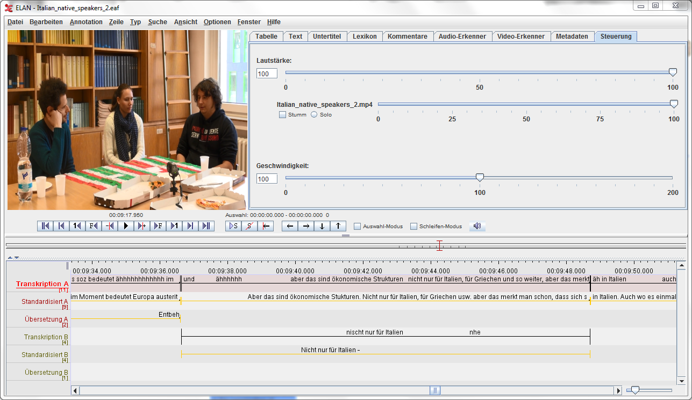
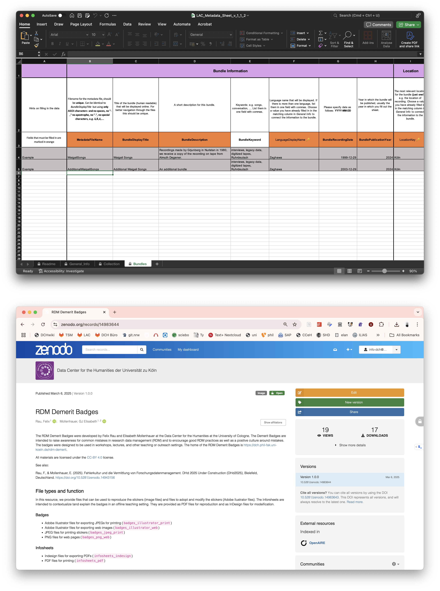

# Ich hab es hier irgendwo

## Grundlagen der Arbeit mit Daten

Felix Rau & Patrick Helling
(Universität zu Köln)
<br/>


---

## Worum geht’s?

Kontrolle beim Umgang mit Daten.

---

### Fahrplan


| Zeit      |        | Inhalt         |
|:----------|:-------|:---------------|
| 14:00 Uhr | 5 min  | Intro          |
| 14:05 Uhr | 30 min | Daten & Co.    |
| 14:35 Uhr | 10 min | FDM Prinzipien |
| 14:50 Uhr | 45 min | Workflows      |
| 15:20 Uhr | 20 min | Diskussion 💥  |
| 15:50 Uhr | 10 min | Abschluss      |


---

## Wer sind wir

<style>
.container{
    display: flex;
}
.col{
    flex: 1;
}
</style>

<div class="container">

  <div class="col">
    <h4>Felix Rau</h4>
    
  </div>

  <div class="col">
    <h4>Patrick Helling</h4>
    
  </div>
</div>

---

## Daten & Co.

---

| Dauer  | Inhalt         |
|:-------|:---------------|
| 5 min  | Daten          |
| 5 min  | Metadaten      |
| 5 min  | Paradaten      |
| 5 min  | Anderer Output |
| 10 min | Diskussion  💥 |

---
<!-- _footer: '<span>GAL Research School 2025</span><span/>' -->
## Daten




In der Linguistik: Repräsentation eines gesprochenen, gebärdeten oder geschreibenen Sprachevents.

---

## Datentypen

Literatur 📚, Bilder 🖼️, Audio 🎤, Fotos  📸, Datenbanken 📀, Videos 🎥, Objekte 🏺, Eye tracking 👀,Tabellen 📊, Manuskripte 📝, Software 💾, fmri-Daten 🩻, ...

---

<!-- _class: quote -->

### Daten

[Leonelli 2016](https://ebookcentral.proquest.com/lib/ubkoeln/detail.action?docID=4532277) defines data as
> any product of research activities, ranging from artifacts such as photographs to symbols such as letters or numbers, that is collected, stored, and disseminated in order to be used as evidence for knowledge claims. 

<small>Leonelli, Sabina. 2016. _Data-Centric Biology: A Philosophical Study._ Chicago ; London: The University of Chicago Press.</small>

---

### Datenmodelle

Sprachliche Interaktionssituation → Videoaufnahme → Transkript → Übersetzung → Morphem-Glossierung → Intonationsannotation

30 Aufnahmen 👆 ⇒ numerischer Datensatz (Morphem-Intonations-Korrelation)

---

### Daten und Datenmodelle

- Welche Daten habe ich?
- Welche Derivate (Transformationen/ANnotationen) habe ich?

---

<!-- _class: quote -->

### Metadaten

> Metadata sind strukturierte Informationen über Forschungsdaten, die das Sammeln, Speichern, die Analyse und Verbreitung der Daten ermöglichen und unterstützen.

---

### Metadaten (Beispiele)

<!-- _footer: '<span>GAL Research School 2025</span><span/>' -->




---

<!-- _class: quote -->

### Paradaten

> The paradata of a data set or survey are data about the process by which the data were collected.
<small>[Wikipedia](https://en.wikipedia.org/wiki/Paradata)</small>

---

### Paradaten (Beispiele)

- Ursprünglich aus der Umfrageforschung
- Heute auch in anderen Disziplinen
- Beispiele: Zeitstempel, keystroke-Daten, Sprechtempo, Befragungszeitpunkt, ...
- Können als eine Art Metadaten betrachtet werden

---

### Anderer Output

- Code
- Paper

---

### Wie sieht es bei euch aus? 💥

---

### Wie sieht es bei euch aus? 💥

- Daten 
    - Rohdaten
    - Derivate/Datenmodelle
- Metadaten
- Paradaten
- Anderer Output

---

## FDM Prinzipien und Workflows

---


| Dauer  | Inhalt         |
|:-------|:---------------|
| 10 min | FDM Prinzipien |
| 10 min | Workflows      |
| 10 min | Datensuche 💥|
| 20 min | Diskussion     |

---

## FDM Prinzipien

---

- Dokumentiere Strukturen
- Dokumentiere Entscheidungen
- Automatisiere Prozesse
- Versioniere Daten
- Wiederholbarkeit (Repeatability)
- Kontrolle über Daten und Prozess

---

### FAIR

<small>https://www.go-fair.org/fair-principles/</small>

- Findable
- Accessible
- Interoperable
- Reusable

---

## Workflows

---

- Acquiring (erheben/erwerben)
- Keeping (Daten halten)
- Handling (handhaben)
- Releasing (veröffenlichen/löschen/archivieren)

---

### Acquiring (erheben/erwerben)

- Dokumentieren, wie Daten erhoben wurden
  - Paradaten
- Datenqualität
- Datenformate
- Rechtliche Aspekte

---

### Datensuche 💥

<!-- _footer: '<span/>' -->

1. VLO (https://vlo.clarin.eu/)
2. BASE (https://www.base-search.net/)
3. FDB (https://www.forschungsdaten-bildung.de/)
4. Google Dataset Search (https://datasetsearch.research.google.com/)
5. SSH Open Marketplace  https://marketplace.sshopencloud.eu/
6. R3Data (Repositories) https://www.re3data.org/search
7. DataCite Commons https://commons.datacite.org/

---

### Keeping (Daten halten)

- Speicherung
- Backup
- Dateitypen
- Ordnerstruktur
- Dateibenennung

---

### Speicherung und Backup

- Speicherung
  - Lokal / Cloud / Institutionell
- Backup
  - 3-2-1 Regel
  - Automatisch
  - Regelmäßige Tests

<small>Rau, F. (2023). _DCH Project Data Storage Guidelines_ (1.0.0). Zenodo. [doi:10.5281/zenodo.7760967](https://doi.org/10.5281/zenodo.7760967)</small>

---

### Dateitypen

- Offene, standatisierte Formate
- Arbeits- und Archivierungsformate

---

### Ordnerstruktur

```bash
project/
├── 01_admin/
├── 02_data/
│   ├── 01_raw/
│   └── 02_processed/
├── 03_code/
├── 04_docs/
├── 05_output/
├── README.md
└── LICENSE
```

<small>Rau, F. (2023). _DCH Folder Structure Guidelines_ (1.0.0). Zenodo. [doi:10.5281/zenodo.7452113](https://doi.org/10.5281/zenodo.7452113)</small>

---

### Dateibenennung

1. Vergib eindeutige, aussagekräftige, lesbare, aber prägnante Namen
2. Wähle Namen, die in allen Datei- und Betriebssystemen sicher sind
3. Strukturiere den Dateinamen und nutze Dateinamenerweiterungen
4. Erleichtere die alphabetische Sortierung
5. Dokumentiere das Benennungsmuster

<small>Rau, F. (2023). DCH File Naming Guidelines (1.0.0). Zenodo. [doi:10.5281/zenodo.7447485](https://doi.org/10.5281/zenodo.7447485)</small>

---

`ger-LK-2023-05-31-001-raw-audio.wav`
`ger-LK-2023-05-31-001-raw-audio.wav`

<small>Rau, F. (2023). DCH File Naming Guidelines (1.0.0). Zenodo. [doi:10.5281/zenodo.7447485](https://doi.org/10.5281/zenodo.7447485)</small>

---

### Handling (handhaben)

- Versionierung
- Dokumentation der Transformationen und Analyse
- Alles in Code
- (Analyse)

---

### Releasing (veröffenlichen/löschen/archivieren)

- Datenarchivierung
- Datenpublikation
- Datenlöschung

---

### Datenarchivierung

- Metadaten
- Datenstandards

---

### Datenpublikation

- Repositoriumssuche
- Metadaten standards

---

### Repositoriumssuche 💥

- OSF (https://osf.io/)
- Zenodo (https://zenodo.org/)
- Fachspezifische Repositorien
  - R3Data (https://www.re3data.org/search)
  - https://www.konsortswd.de/angebote/forschende/alle-datenzentren/
- Institutionelle Repositorien (Lokale Einrichtungen)

---

<!-- _footer: '<span>GAL Research School 2025</span><span/>' -->

### Eure Perspektive 💥

- Wie organisiert ihr eure Daten?
- Welche Herausforderungen seht ihr?
- Welche Best Practices könnt ihr teilen?
- Gibt es offene Fragen oder Unsicherheiten?
- Wie könnte ein idealer Workflow für euch aussehen?
- Welche Tools oder Ressourcen nutzt ihr bereits?

---

<!-- footer: '<div>  <a href="https://creativecommons.org/licenses/by/4.0/">CC-BY 4.0</a></div> <div/> <div/>'-->


## Danke!

<info-dch@uni-koeln.de>
